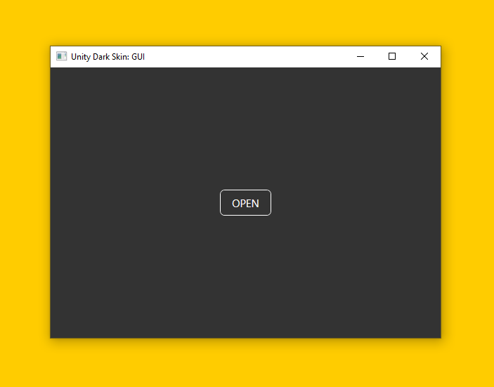
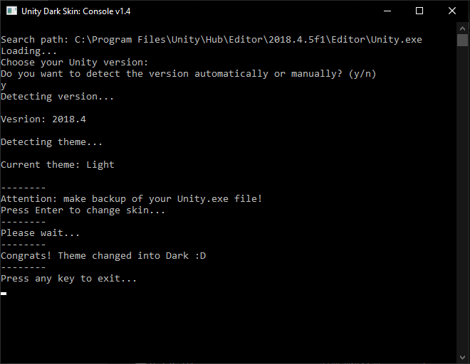
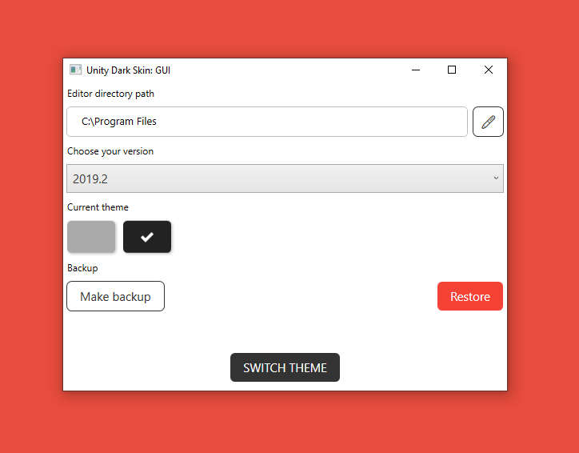

# UnityDarkSkin

## About

This tool makes Dark Theme in Unity Editor and turns it back to 'terrible' Light Theme, if you wish. It's being useful for Unity Personal, where theme settings are disabled by default. **It is not a crack! It's simply changing a couple of bits in Editor.exe**

## Usage

1. Compile one of both projects (UnityDarkSkin.App or UnityDarkSkin) with Visual Studio 
1.1. For **UnityDarkSkin** project: Move **UnityDarkSkin.exe** to folder where Unity.exe is located 
1.2. For **UnityDarkSkin.App** project: Do nothing at this stage (**Unity Dark Skin.exe** is ready to work after compilation) 
2. Run an executable file as **Administrator** 

## Projects

| Project                | .NET version    | Role               |  Description                     |
| --- | --- | --- | --- |
| UnityDarkSkin.App      | >= 4.8          | WPF application    | Advanced functionality via UI    |
| UnityDarkSkin.Lib      | >= 4.8          | Patcher library    | Versions data (byte records)     |
| UnityDarkSkin (Legacy) | >= 4.8          | Console application| Basic functionality via Console  |

## Requirements

* Windows 8/10
* Visual Studio 2019 (or newer)
* .NET Framework >= 4.8
* .NET Core >= 3.1
* .NET Standard 2.0 support

## Supported versions

| Version | Support | Tested on |
| :--- | :---: | :--- |
| 5.3    | ✅ | 5.3.5f1    |
| 5.4    | ✅ | 5.4        |
| 2017.2 | ✅ | 2017.2     |
| 2018.2 | ✅ | 2018.2     |
| 2018.3 | ✅ | 2018.3.0f2 |
| 2018.4 | ✅ | 2018.4.24f1 (LTS) |
| 2019.1 | ✅ | 2019.1.0f2 |
| 2019.2 | ✅ | 2019.2.0f1, 2019.2.14f1 |
| 2019.3 | ✅ | 2019.3.0f1 |
| 2020.1 | ✅ | 2020.1.0f1 |

✅ - Supported | ⚠️ - Work in progress | ❌ - Not supported

## How it works

| Before | After |
| :---: | :---: |
|  |  |

## Showcase

| UnityDarkSkin.App | UnityDarkSkin |
| :---: | :---: |
|  |  |
|  |  |
|  |  |
|  |  |

