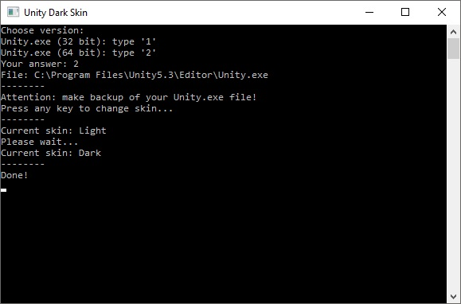

## About
This tool makes Dark Theme in Unity Editor and turns it back to white, if you wish. It's being useful for Unity Personal, where Dark Theme is disabled by default. <b>It's not a crack! It's simply changing a couple of bits in Editor.exe</b>

## Usage
1. Compile it in Visual Studio and copy UnityDarkSkin.exe to folder where Unity.exe is located
2. Run UnityDarkSkin.exe as administrator

## Supported versions
* 5.0 to 2018.2 (tested on 5.3, 5.4, 2017.2, 2018.2)
* 2018.3
* 2019.1

## How it works?

