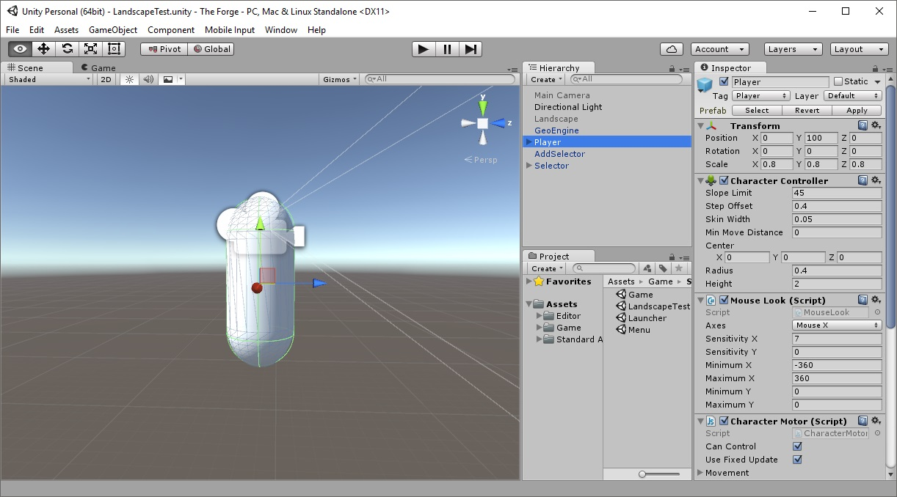
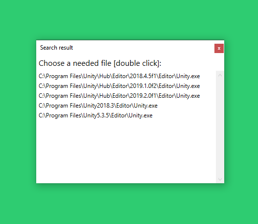
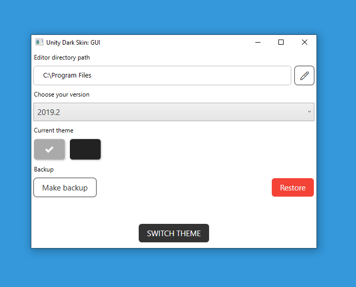

# UnityDarkSkin

## About

This tool makes Dark Theme in Unity Editor and turns it back to 'terrible' Light Theme, if you wish. It's being useful for Unity Personal, where theme settings are disabled by default. **It is not a crack! It's simply changing a couple of bits in Editor.exe**

## Usage

1. Compile `UnityDarkSkin.App` with Visual Studio
2. Run an executable file as **Administrator**

## Projects

| Project                | .NET version    | Role               |  Description                     |
| --- | --- | --- | --- |
| UnityDarkSkin.App      | Core 5.0        | WPF application    | Advanced functionality via UI    |
| UnityDarkSkin.Lib      | Core 5.0        | Patcher library    | Versions data (byte records)     |

## Requirements

* Windows 10 (on newer)
* Visual Studio 2019 (or newer)
* .NET 5.0 SDK

## Supported versions

| Version | Status | Tested on |
| :--- | :---: | :--- |
| 5.3    | ✅ | 5.3.5f1    |
| 5.4    | ✅ | 5.4        |
| 2017.2 | ✅ | 2017.2     |
| 2018.2 | ✅ | 2018.2     |
| 2018.3 | ✅ | 2018.3.0f2 |
| 2018.4 | ✅ | 2018.4.24f1 (LTS) |
| 2019.1 | ✅ | 2019.1.0f2 |
| 2019.2 | ✅ | 2019.2.0f1, 2019.2.14f1 |
| 2019.3 | ✅ | 2019.3.0f1 |
| 2020.1 | ✅ | 2020.1.0f1 |

✅ - Supported | ⚠️ - Work in progress | ❌ - Not supported

## How it works

| Before | After |
| :---: | :---: |
|  |  |

## Showcase

| UnityDarkSkin.App | UnityDarkSkin |
| :---: | :---: |
|  |  |
|  |  |
|  |  |
|  |  |

